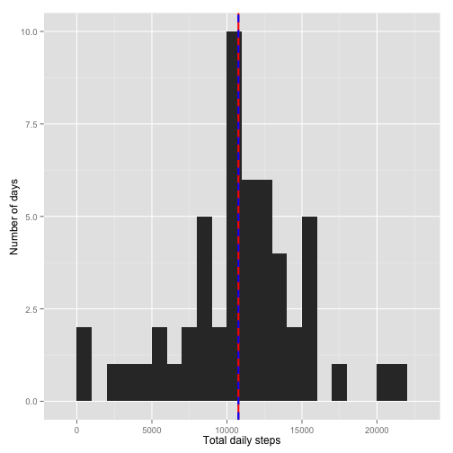
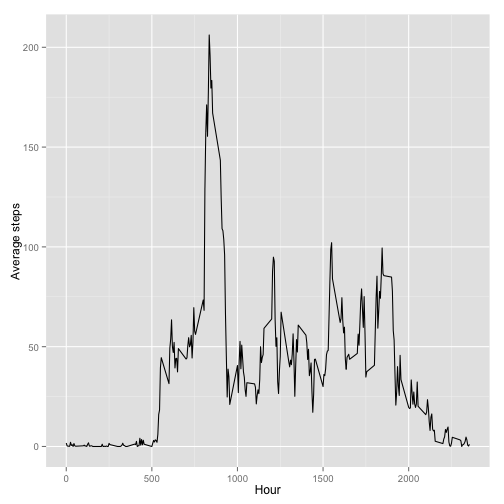
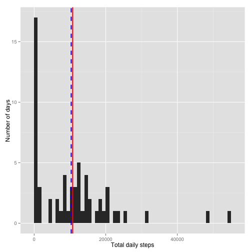
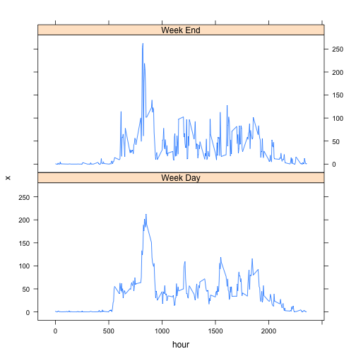

# Reproducible Research: Peer Assessment 1

```
setwd("~/Coursera/jhdss/5-repro/RepData_PeerAssessment1")
```

## Loading and preprocessing the data

```r
d <- read.csv("activity.csv", stringsAsFactors = FALSE)
d$date <- as.Date(d$date)
stepsByDay <- aggregate(d$steps, by = list(day = d$date), sum)
# meanStepsByDay <- aggregate(d$steps, by=list(day = d$date), mean)
library(ggplot2)
ggplot(stepsByDay, aes(x = x)) + geom_histogram(binwidth = 1000) + labs(x = "Total daily steps") + 
    labs(y = "Number of days") + geom_vline(aes(xintercept = mean(x, na.rm = T)), 
    color = "red", linetype = "solid", size = 1) + geom_vline(aes(xintercept = median(x, 
    na.rm = T)), color = "blue", linetype = "dashed", size = 1)
```

 


## What is mean total number of steps taken per day?

```r
mean(stepsByDay$x, na.rm = T)
```

```
## [1] 10766
```

```r
median(stepsByDay$x, na.rm = T)
```

```
## [1] 10765
```


As previously shown on the plot the median and mean steps taken per day are almost equal at about 10765 steps.

## What is the average daily activity pattern?

```r
meanStepsByInterval <- aggregate(d$steps, by = list(hour = d$interval), mean, 
    na.rm = TRUE)

g <- ggplot(meanStepsByInterval, aes(x = hour, y = x))
g + geom_line() + labs(y = "Average steps") + labs(x = "Hour")
```

 


```r
meanStepsByInterval[meanStepsByInterval$x == max(meanStepsByInterval$x), ]
```

```
##     hour     x
## 104  835 206.2
```


The 5 minute interval where average steps taken is maximal is the one at 8:35 AM with an average 206 steps taken.

## Imputing missing values

Counting NAs in the entire dataset : 

```r
nrow(d[is.na(d$steps), ])
```

```
## [1] 2304
```


There are 2304 missing values in the steps column.

Let's use the interval mean across all days to impute them :

```r
e <- merge(d, meanStepsByInterval, by.x = "interval", by.y = "hour", all.x = TRUE)
e[is.na(e$steps), "steps"] <- e[is.na(e$steps), "x"]
dNoNa <- subset(e, select = -x)

stepsByDayNoNa <- aggregate(dNoNa$steps, by = list(day = d$date), sum)

ggplot(stepsByDayNoNa, aes(x = x)) + geom_histogram(binwidth = 1000) + labs(x = "Total daily steps") + 
    labs(y = "Number of days") + geom_vline(aes(xintercept = mean(x, na.rm = T)), 
    color = "red", linetype = "solid", size = 1) + geom_vline(aes(xintercept = median(x, 
    na.rm = T)), color = "blue", linetype = "dashed", size = 1)
```

 

```r

mean(stepsByDayNoNa$x, na.rm = T)
```

```
## [1] 10766
```

```r
median(stepsByDayNoNa$x, na.rm = T)
```

```
## [1] 10352
```


The mean remains unchanged but the median has slightly decreased, about 415 steps lower than before imputation.

## Are there differences in activity patterns between weekdays and weekends?


```r
dNoNa$weekDay <- weekdays(stepsByDayNoNa$day)
dNoNa$weekEnd <- ifelse(dNoNa$weekDay == "Saturday" | dNoNa$weekDay == "Sunday", 
    "Week End", "Week Day")
```


```r
meanStepsByIntervalAndWeekDay <- aggregate(dNoNa$steps, by = list(timeOfWeek = dNoNa$weekEnd, 
    hour = dNoNa$interval), mean, na.rm = TRUE)
library(lattice)
xyplot(x ~ hour | timeOfWeek, data = meanStepsByIntervalAndWeekDay, type = "l", 
    layout = c(1, 2))
```

 


Week-end activity seems to have higher variance, maybe because sedentary workers get to move a bit more on the week-ends?

